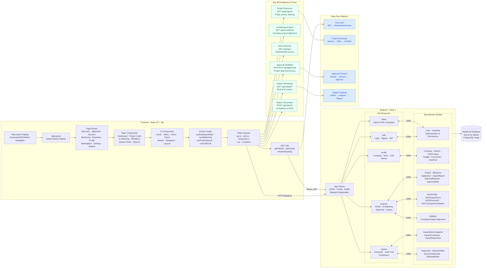

<div align="center">

# 🌱 SustainAlign

**End-to-End CSR/ESG Management & Alignment Platform with AI Agents**

[](#)
[](#)
[](#)
[](#)
[](#)
[](#)
[](#)

</div>

> **AI-Powered CSR/ESG Platform**: Aligning corporates, NGOs, and regulators through intelligent project discovery, evaluation, and impact tracking.

---

## 🎯 Problem Statement


---

## 🚀 Solution: AI-Agent Powered Platform

SustainAlign uses **6 specialized AI agents** to automate and optimize the entire CSR/ESG lifecycle:


---

## 👥 Target Users


---

## ✨ Platform Highlights
- 🎨 **Elegant UI**: React 19 + Tailwind v4 with soft gradients, rounded cards, and subtle motion
- 📈 **Insightful Charts**: Highcharts dashboards (allocation, trends, ESG, SDG); transparent cards for dark-on-light clarity
- 🧭 **App Shell**: Role-aware TopNav and modular routes (Discovery, Alignment, Decision, Monitoring, Reporting)
- 🔐 **Auth-ready**: Login / Signup / Forgot / Profile Setup + JWT parsing helper
- ⚙️ **API-first backend**: Flask 3, SQLAlchemy, CORS; clean blueprints per domain
- 🧩 **Extensible**: Componentized pages (cards, tables, charts) + sensible aliases (`@pages`, `@components`)

---

## 🔗 Quick Links
- Frontend guide: `frontend/README.md`
- Backend guide: `backend/README.md`
- Prototypes: `html/` (e.g. `html/dashboard.html`)

---

## 🏗️ Architecture



### Roles & Navigation
- **Admin**: Full Dashboard + Monitoring/Reporting suite
- **Corporate**: Discovery, Alignment, Impact Dashboard; Company Profile (form + showcase)
- **NGO**: Marketplace and Company Showcase view

---

## 🧭 Project Structure
```text
sustainalign/
├─ backend/                  # Flask API + admin HTML views
│  ├─ app.py                 # App factory, CORS, health, blueprints
│  ├─ models/                # SQLAlchemy models (users, companies, projects, ai matching, ...)
│  ├─ routes/                # auth, projects, profile, reports, views
│  ├─ templates/             # Minimal admin HTML (Tailwind)
│  └─ requirements.txt       # Flask, CORS, SQLAlchemy, PyJWT, etc.
│
├─ frontend/                 # React + Vite SPA
│  ├─ src/
│  │  ├─ layouts/AppLayout.jsx      # Global shell (TopNav + content)
│  │  ├─ components/TopNav.jsx      # Universal navigation
│  │  ├─ lib/api.js                 # apiPost helper
│  │  ├─ pages/
│  │  │  ├─ auth/                   # Auth screens (AuthLayout + pages)
│  │  │  ├─ dashboard/              # Admin dashboard (widgets + charts)
│  │  │  ├─ discovery/ alignment/ decision/ monitoring/ reporting/
│  │  │  ├─ marketplace/ settings/ profile/ support/
│  │  ├─ App.jsx                    # All routes
│  │  └─ main.jsx                   # App bootstrap + Router
│  └─ vite.config.js                # Tailwind v4 plugin + path aliases
│
└─ html/                     # Static prototypes (reference designs)
```

---

## 🚀 Quickstart

### Frontend (Vite + React)
```bash
cd frontend
npm install
npm run dev
# http://localhost:5173
```

### Backend (Flask)
```bash
cd backend
python -m venv .venv
# Windows PowerShell
. .venv/Scripts/Activate.ps1
# macOS/Linux
# source .venv/bin/activate

pip install -r requirements.txt
# Environment (examples)
$env:SECRET_KEY = "dev-secret"
$env:CORS_ORIGIN = "http://localhost:5173"
$env:FLASK_ENV = "development"
python app.py
# http://localhost:5000
```
Health check: `GET /api/health` → `{ "status": "ok" }`

---

## 🖼️ Key Screens and Routes
| Area | Routes | AI Agent |
|---|---|---|
| **Auth** | `/login`, `/signup`, `/forgot-password`, `/profile-setup` | - |
| **Dashboard** | `/dashboard` (admin) | - |
| **Discovery** | `/discovery/search`, `/discovery/cards` | **Agent 1** |
| **Alignment** | `/alignment/matching`, `/alignment/comparison-matrix`, `/alignment/risk` | **Agent 2 & 3** |
| **Monitoring** | `/monitoring/impact`, `/monitoring/tracker`, `/monitoring/alerts` | **Agent 5** |
| **Reporting** | `/reporting/generator`, `/reporting/audit-trail` | **Agent 6** |
| **Marketplace** | `/marketplace/ngo`, `/marketplace/matching`, `/marketplace/collaboration` | - |
| **Settings** | `/settings/users`, `/settings/agents`, `/settings/apis`, `/settings/integrations` | - |
| **Profile** | `/profile/company-details`, `/profile/csr-history`, `/profile/sdg-selector` | - |
| **Support** | `/support/chat`, `/support/faq`, `/support/feedback` | - |

> Prototypes in `html/` mirror many routes (open in browser for quick reference).

---

## 🎛️ Frontend Details
- **Styling**: Tailwind v4 via `@tailwindcss/vite`; animated ambient backgrounds in `src/index.css`
- **Charts**: Highcharts + `highcharts-react-official`
- **Aliases**: `@pages`, `@components`, `@constants`
- **Scripts** (run in `frontend/`):
```bash
npm run dev       # Start dev server
npm run build     # Production build → dist/
npm run preview   # Preview production build
```

### Admin Dashboard Widgets (Highcharts-ready)
- KPIs bar (budget, utilized, projects, compliance, ESG)
- Budget allocation vs utilization (chart), 12‑month trend (chart)
- ESG breakdown + company vs industry (charts), SDG heatmap grid
- Active projects list + sector distribution (chart) + impact KPIs
- Compliance alerts + risk meter gauge
- AI insights (suggestions, top 3, forecast)
- Quick actions + footer compliance progress

---

## 🔧 Backend Details
- App factory, SQLAlchemy, CORS, and blueprints (`auth`, `projects`, `profile`, `reports`)
- Minimal admin HTML views under `/` for quick inspection
- Configure via env: `SECRET_KEY`, `CORS_ORIGIN`, `PORT`, etc.

### Data Model (high-level)
- Users (roles: admin, corporate, ngo)
- Company, CompanyBranch, CSRContact, Budget, FocusArea, NGOPreference, AIConfig, UserRole
- Projects, ProjectMilestone, ProjectApplication, ProjectImpactReport, NGOProfile
- AI Match (company ↔ project alignment)

### API Endpoints (selected)
- `GET /api/projects` — List/filter projects (public)
- `POST /api/projects` — Create project (guest fallback enabled)
- `PUT /api/projects/:id` — Update project (authZ: owner/admin)
- `GET /api/ngos` — List NGO profiles (auth)
- `GET /api/ai-matches` — Ranked matches (public)

---

## 📋 Example Walkthrough: Infosys CSR Management


### 1. Profile Setup
- **Budget**: ₹50 Cr
- **Focus Areas**: Education (SDG 4), Climate (SDG 13)
- **Past Reports**: Upload previous CSR activities

### 2. Project Discovery (Agent 1)
AI fetches projects from NGOs:
- **GreenFuture NGO**: "Plant 1M trees in rural Karnataka"
- **EduBridge NGO**: "Digital literacy in rural schools"

### 3. Alignment & Evaluation (Agent 2 & 3)
AI scoring results:
- **GreenFuture Trees**: 92% aligned (SDG 13, climate focus)
- **EduBridge Education**: 87% aligned (SDG 4, education focus)

### 4. Decision Support (Agent 4)
Infosys Board sees AI's top 3 projects with "Why" explanations and approves 2 projects.

### 5. Monitoring & Tracking (Agent 5)
Real-time updates:
- **300K trees planted** (progress tracking)
- **5,000 students educated**
- **₹20 Cr utilized**
- **Alerts**: "Tree project delayed by 1 month due to rains"

### 6. Reporting (Agent 6)
End of year → Auto-generated CSR compliance report for government submission with full audit trail.

---

## 🧪 Smoke Test
```bash
# Frontend
cd frontend && npm run dev
# Backend
cd backend && python app.py
# In browser
http://localhost:5173
http://localhost:5000/api/health
```

---

## 📦 Deploy Notes
- Frontend: `npm run build` → serve `frontend/dist/` (enable SPA fallback)
- Backend: run behind a WSGI server; set `CORS_ORIGIN` to deployed frontend URL

---

## 🤝 Contributing
- Small, focused PRs welcome
- Keep components modular and accessible
- Charts: keep options data-driven and themable

---

### UX Notes
- Soft, accessible color scheme; consistent spacing; shadow hierarchy
- Mobile-friendly grids; sticky table headers; animated hero sections

---

## ✅ End Results

- **Corporates** → Smarter CSR spend, no compliance headache
- **NGOs** → More visibility, fair funding opportunities  
- **Regulators** → Transparent, AI-audited CSR tracking

---

<div align="center">
Made with care for sustainability‑minded teams 🌍
</div>
