<div align="center">


# 🌱 SustainAlign

**End-to-End CSR/ESG Management & Alignment Platform with AI Agents**

[](#)
[](#)
[](#)
[](#)
[](#)
[](#)
[](#)

</div>

> **AI-Powered CSR/ESG Platform**: Aligning corporates, NGOs, and regulators through intelligent project discovery, evaluation, and impact tracking. SustainAlign is the first agent-powered platform that automates CSR + Sustainability metrics end-to-end — ensuring corporates spend smarter, NGOs gain visibility, and regulators get compliance-ready transparency.

Abstract

Did you know? India is the only country in the world with a legislated CSR law — yet ₹7,000+ crore goes unspent every year. Why? Because corporates can’t find credible NGOs, NGOs can’t prove impact, and regulators drown in compliance chaos.

❌ Current CSR reality: Days of manual project search, fragmented reports, compliance risks, and greenwashing.

✅ With SustainAlign: Few minutes to discover verified NGOs, align projects with SDGs, get AI-backed recommendations, and auto-generate MCA/SEBI + global ESG-ready reports.

SustainAlign is the first India-first, AI-agentic CSR & ESG platform It connects corporates, NGOs, and regulators through six specialized agents:

🔎 Discovery → Verified NGO projects

🎯 Alignment & Evaluation → Budget-SDG matching + impact scoring

🧑‍⚖️ Decision → Explainable AI “Top 3” recommendations

📡 Monitoring → Live project tracking + alerts

📑 Reporting → Audit-proof CSR + ESG compliance (MCA, SEBI, GRI, SASB, UN SDGs)


👉 SustainAlign = LinkedIn + Bloomberg Terminal for CSR & ESG in India.

Not just an idea. Not just a demo. A working prototype solving a real India-first problem 
---

## 🎯 Problem Statement


**The Challenge**: Corporates in India face mandatory CSR spending requirements but struggle with:
- **Project Discovery**: Finding the right NGOs and projects aligned to their goals
- **Manual Reporting**: Scattered, time-consuming compliance documentation
- **Transparency Issues**: Lack of visibility into CSR fund utilization and impact
- **NGO Visibility**: Limited opportunities for NGOs to showcase their projects
- **Regulatory Compliance**: Complex reporting requirements for government bodies

---

## 🚀 Solution: AI-Agent Powered Platform

SustainAlign is an AI-powered CSR-focused platform designed to connect NGO projects with corporate companies to promote sustainable development and CSR initiatives.


**Our AI-Agent Ecosystem**:
- **🤖 Agent 1 (Discovery)**: Intelligent project discovery and filtering
- **🎯 Agent 2 (Alignment)**: Company-project matching and scoring
- **📊 Agent 3 (Evaluation)**: Risk assessment and credibility scoring
- **🧠 Agent 4 (Decision Support)**: AI-powered decision recommendations
- **📈 Agent 5 (Monitoring)**: Real-time impact tracking and alerts
- **📋 Agent 6 (Reporting)**: Automated compliance and ESG reporting

---

## 👥 Target Users


**Primary Stakeholders**:
- **🏢 Corporate Users**: Sustainability officers, CSR managers, decision-makers
- **🌍 NGOs**: Project managers, impact coordinators, community leaders
- **🏛️ Regulators**: Government bodies, compliance officers, auditors
- **👥 Communities**: Beneficiaries, local stakeholders, impact recipients

---

## 🌟 Platform Transformation: Before vs After

### Before SustainAlign

**Traditional Challenges**:
- Manual project discovery through scattered sources
- Time-consuming approval processes
- Limited transparency in fund utilization
- Complex compliance reporting
- No real-time impact tracking

### After SustainAlign Implementation


**Modern Solutions**:
- AI-powered project discovery and matching
- Streamlined approval workflows
- Real-time transparency and tracking
- Automated compliance reporting
- Comprehensive impact analytics

### Enhanced Impact Areas
<div align="center">

</div>

**Improved Outcomes**:
- Better project alignment with corporate goals
- Increased NGO visibility and funding opportunities
- Enhanced regulatory compliance and transparency
- Measurable impact tracking and reporting

---

## 🇮🇳 India Impact Areas & Focus

### Primary Impact Sectors

**Key Focus Areas**:
- **Education**: Digital literacy, skill development, rural education
- **Healthcare**: Primary healthcare, maternal health, disease prevention
- **Environment**: Afforestation, waste management, renewable energy
- **Rural Development**: Infrastructure, livelihood, community empowerment
- **Women Empowerment**: Skill training, entrepreneurship, leadership

### Regional Impact Distribution
<div align="center">

</div>

**Geographic Coverage**:
- **North India**: Education and healthcare initiatives
- **South India**: Technology and skill development
- **East India**: Rural development and agriculture
- **West India**: Industrial and urban development
- **Central India**: Tribal and community development

---

## 🔗 User Connections & Ecosystem

<div align="center">

</div>

**Platform Ecosystem**:
- **Corporate ↔ NGO**: Direct project funding and collaboration
- **NGO ↔ Community**: Local impact and beneficiary engagement
- **Corporate ↔ Regulator**: Compliance reporting and transparency
- **AI Agents**: Intelligent matching and decision support
- **Platform**: Centralized management and coordination

---

## ✨ Platform Highlights
- 🎨 **Elegant UI**: React 19 + Tailwind v4 with soft gradients, rounded cards, and subtle motion
- 📈 **Insightful Charts**: Highcharts dashboards (allocation, trends, ESG, SDG); transparent cards for dark-on-light clarity
- 🧭 **App Shell**: Role-aware TopNav and modular routes (Discovery, Alignment, Decision, Monitoring, Reporting)
- 🔐 **Auth-ready**: Login / Signup / Forgot / Profile Setup + JWT parsing helper
- ⚙️ **API-first backend**: Flask 3, SQLAlchemy, CORS; clean blueprints per domain
- 🧩 **Extensible**: Componentized pages (cards, tables, charts) + sensible aliases (`@pages`, `@components`)

---

## 🔗 Quick Links
- Frontend guide: `frontend/README.md`
- Backend guide: `backend/README.md`
- Prototypes: `html/` (e.g. `html/dashboard.html`)

---

## 🏗️ Architecture

```mermaid
flowchart LR
  %% Frontend
  subgraph FE[Frontend · React 19 + Vite]
    FE_TopNav["Role-aware TopNav<br/>Corporate/NGO/Admin Navigation"]
    FE_Layouts["AppLayout<br/>Global Shell & Sidebar"]
    FE_Routes["Page Routes<br/>Discovery · Alignment · Decision<br/>Monitoring · Reporting · Profile<br/>Marketplace · Settings · Support"]
    FE_Components["UI Components<br/>Cards · Tables · Forms · Charts<br/>Modals · Navigation · Layouts"]
    FE_Pages["Page Components<br/>Dashboard · Project Cards<br/>AI Matching · Workflows<br/>Impact Charts · Reports"]
    FE_Hooks["Custom Hooks<br/>useDashboardData · useAiMatching<br/>useProjectSearch · useAuditTrail"]
    FE_Lib["Utility Libraries<br/>api.js · auth.js · projectApi.js<br/>ui.js · constants"]
    FE_Auth["JWT Utils<br/>getToken() · parseJwt()<br/>isAuthenticated()"]
  end

  %% Backend
  subgraph BE[Backend · Flask 3]
    BE_App["App Factory<br/>CORS · Config · Health<br/>Blueprint Registration"]
    subgraph BP[API Blueprints]
      BP_Auth[auth<br/>Login · Signup · JWT]
      BP_Projects[projects<br/>CRUD · AI Matching<br/>Approvals · Impact]
      BP_Profile[profile<br/>Company · NGO · CSR History]
      BP_Reports[reports<br/>Generator · Audit Trail<br/>Compliance]
      BP_Views["views<br/>Admin HTML Templates"]
    end
    subgraph Models[SQLAlchemy Models]
      M_User["User · UserRole<br/>Authentication & Permissions"]
      M_Company["Company · Branch · CSRContact<br/>Budget · FocusArea · NGOPref"]
      M_Project["Project · Milestone<br/>Application · ImpactReport<br/>ApprovalRequest · ApprovalStep"]
      M_NGO["NGOProfile · NGOImpactEvent<br/>NGODocument · NGOTransparencyReport"]
      M_Match["AIMatch<br/>Company-Project Alignment"]
      M_Monitoring["ImpactMetricSnapshot<br/>ImpactTimeSeries · ImpactRegionStat"]
      M_Reporting["ReportJob · ReportArtifact<br/>DecisionRationale · RationaleNote"]
    end
  end

  %% Data Stores
  DB[(Relational Database<br/>SQLite by default<br/>PostgreSQL ready)]

  %% Frontend Connections
  FE_TopNav --> FE_Layouts
  FE_Layouts --> FE_Routes
  FE_Routes --> FE_Pages
  FE_Pages --> FE_Components
  FE_Components --> FE_Hooks
  FE_Hooks --> FE_Lib
  FE_Lib --> FE_Auth

  %% API Communication
  FE_Lib -->|HTTP Requests| BE_App
  FE_Auth -->|Bearer JWT| BE_App

  %% Backend Internal
  BE_App --> BP_Auth
  BE_App --> BP_Projects
  BE_App --> BP_Profile
  BE_App --> BP_Reports
  BE_App --> BP_Views

  %% Blueprint to Model Relationships
  BP_Auth <-->|ORM| M_User
  BP_Profile <-->|ORM| M_Company
  BP_Projects <-->|ORM| M_Project
  BP_Projects <-->|ORM| M_NGO
  BP_Projects <-->|ORM| M_Match
  BP_Reports <-->|ORM| M_Monitoring
  BP_Reports <-->|ORM| M_Reporting
  BP_Views <-->|ORM| M_User

  %% Models to Database
  Models --> DB

  %% Notable API Flows
  classDef note fill:#ecfdf5,stroke:#10b981,color:#065f46
  subgraph Flows["Key API Endpoints & Flows"]
    F1["Project Discovery<br/>GET /api/projects<br/>Public access, filtering"]:::note
    F2["AI Matching Engine<br/>GET /api/ai-matches<br/>Company-project alignment"]:::note
    F3["NGO Directory<br/>GET /api/ngos<br/>Authenticated access"]:::note
    F4["Approval Workflow<br/>POST/PUT /api/approvals<br/>Project approval process"]:::note
    F5["Impact Monitoring<br/>GET /api/impact/*<br/>Real-time metrics"]:::note
    F6["Report Generation<br/>POST /api/reports<br/>Compliance & ESG"]:::note
  end

  FE_Lib --> F1
  FE_Lib --> F2
  FE_Lib --> F3
  FE_Lib --> F4
  FE_Lib --> F5
  FE_Lib --> F6

  %% Data Flow Indicators
  classDef flow fill:#dbeafe,stroke:#3b82f6,color:#1e40af
  subgraph DataFlow["Data Flow Patterns"]
    DF1["User Auth<br/>JWT → Role-based Access"]:::flow
    DF2["Project Discovery<br/>Search → Filter → AI Rank"]:::flow
    DF3["Approval Process<br/>Submit → Review → Approve"]:::flow
    DF4["Impact Tracking<br/>Collect → Analyze → Report"]:::flow
  end

  FE_Auth --> DF1
  F1 --> DF2
  F4 --> DF3
  F5 --> DF4
```



### Roles & Navigation
- **Admin**: Full Dashboard + Monitoring/Reporting suite
- **Corporate**: Discovery, Alignment, Impact Dashboard; Company Profile (form + showcase)
- **NGO**: Marketplace and Company Showcase view

---

## 🧭 Project Structure
```text
sustainalign/
├─ backend/                  # Flask API + admin HTML views
│  ├─ app.py                 # App factory, CORS, health, blueprints
│  ├─ models/                # SQLAlchemy models (users, companies, projects, ai matching, ...)
│  ├─ routes/                # auth, projects, profile, reports, views
│  ├─ templates/             # Minimal admin HTML (Tailwind)
│  └─ requirements.txt       # Flask, CORS, SQLAlchemy, PyJWT, etc.
│
├─ frontend/                 # React + Vite SPA
│  ├─ src/
│  │  ├─ layouts/AppLayout.jsx      # Global shell (TopNav + content)
│  │  ├─ components/TopNav.jsx      # Universal navigation
│  │  ├─ lib/api.js                 # apiPost helper
│  │  ├─ pages/
│  │  │  ├─ auth/                   # Auth screens (AuthLayout + pages)
│  │  │  ├─ dashboard/              # Admin dashboard (widgets + charts)
│  │  │  ├─ discovery/ alignment/ decision/ monitoring/ reporting/
│  │  │  ├─ marketplace/ settings/ profile/ support/
│  │  ├─ App.jsx                    # All routes
│  │  └─ main.jsx                   # App bootstrap + Router
│  └─ vite.config.js                # Tailwind v4 plugin + path aliases
│
├─ docs/                     # Project documentation and images
│  └─ images/                # Visual assets and screenshots
│     ├─ problem_statement.png      # Problem visualization
│     ├─ solution_features.png      # Solution overview
│     ├─ target_users.png          # User personas
│     ├─ lifecycle.png             # CSR project lifecycle
│     ├─ users_connections.png     # Platform ecosystem
│     ├─ before%20vs%20after*.jpg      # Transformation comparison
│     ├─ India%20Impact%20areas*.png   # Regional focus areas
│     ├─ logo.png                  # SustainAlign branding
│     └─ Poster%20-%20Sustain%20Align.png # Project overview poster
│
└─ html/                     # Static prototypes (reference designs)
```

---

## 🚀 Quickstart

### Frontend (Vite + React)
```bash
cd frontend
npm install
npm run dev
# http://localhost:5173
```

### Backend (Flask)
```bash
cd backend
python -m venv .venv
# Windows PowerShell
. .venv/Scripts/Activate.ps1
# macOS/Linux
# source .venv/bin/activate

pip install -r requirements.txt
# Environment (examples)
$env:SECRET_KEY = "dev-secret"
$env:CORS_ORIGIN = "http://localhost:5173"
$env:FLASK_ENV = "development"
python app.py
# http://localhost:5000
```
Health check: `GET /api/health` → `{ "status": "ok" }`

---

## 🖼️ Key Screens and Routes
| Area | Routes | AI Agent |
|---|---|---|
| **Auth** | `/login`, `/signup`, `/forgot-password`, `/profile-setup` | - |
| **Dashboard** | `/dashboard` (admin) | - |
| **Discovery** | `/discovery/search`, `/discovery/cards` | **Agent 1** |
| **Alignment** | `/alignment/matching`, `/alignment/comparison-matrix`, `/alignment/risk` | **Agent 2 & 3** |
| **Monitoring** | `/monitoring/impact`, `/monitoring/tracker`, `/monitoring/alerts` | **Agent 5** |
| **Reporting** | `/reporting/generator`, `/reporting/audit-trail` | **Agent 6** |
| **Marketplace** | `/marketplace/ngo`, `/marketplace/matching`, `/marketplace/collaboration` | - |
| **Settings** | `/settings/users`, `/settings/agents`, `/settings/apis`, `/settings/integrations` | - |
| **Profile** | `/profile/company-details`, `/profile/csr-history`, `/profile/sdg-selector` | - |
| **Support** | `/support/chat`, `/support/faq`, `/support/feedback` | - |

> Prototypes in `html/` mirror many routes (open in browser for quick reference).

---

## 🎛️ Frontend Details
- **Styling**: Tailwind v4 via `@tailwindcss/vite`; animated ambient backgrounds in `src/index.css`
- **Charts**: Highcharts + `highcharts-react-official`
- **Aliases**: `@pages`, `@components`, `@constants`
- **Scripts** (run in `frontend/`):
```bash
npm run dev       # Start dev server
npm run build     # Production build → dist/
npm run preview   # Preview production build
```

### Admin Dashboard Widgets (Highcharts-ready)
- KPIs bar (budget, utilized, projects, compliance, ESG)
- Budget allocation vs utilization (chart), 12‑month trend (chart)
- ESG breakdown + company vs industry (charts), SDG heatmap grid
- Active projects list + sector distribution (chart) + impact KPIs
- Compliance alerts + risk meter gauge
- AI insights (suggestions, top 3, forecast)
- Quick actions + footer compliance progress

---

## 🔧 Backend Details
- App factory, SQLAlchemy, CORS, and blueprints (`auth`, `projects`, `profile`, `reports`)
- Minimal admin HTML views under `/` for quick inspection
- Configure via env: `SECRET_KEY`, `CORS_ORIGIN`, `PORT`, etc.

### Data Model (high-level)
- Users (roles: admin, corporate, ngo)
- Company, CompanyBranch, CSRContact, Budget, FocusArea, NGOPreference, AIConfig, UserRole
- Projects, ProjectMilestone, ProjectApplication, ProjectImpactReport, NGOProfile
- AI Match (company ↔ project alignment)

### API Endpoints (selected)
- `GET /api/projects` — List/filter projects (public)
- `POST /api/projects` — Create project (guest fallback enabled)
- `PUT /api/projects/:id` — Update project (authZ: owner/admin)
- `GET /api/ngos` — List NGO profiles (auth)
- `GET /api/ai-matches` — Ranked matches (public)

---

## 📋 Example Walkthrough: Infosys CSR Management


### 1. Profile Setup
- **Budget**: ₹50 Cr
- **Focus Areas**: Education (SDG 4), Climate (SDG 13)
- **Past Reports**: Upload previous CSR activities

### 2. Project Discovery (Agent 1)
AI fetches projects from NGOs:
- **GreenFuture NGO**: "Plant 1M trees in rural Karnataka"
- **EduBridge NGO**: "Digital literacy in rural schools"

### 3. Alignment & Evaluation (Agent 2 & 3)
AI scoring results:
- **GreenFuture Trees**: 92% aligned (SDG 13, climate focus)
- **EduBridge Education**: 87% aligned (SDG 4, education focus)

### 4. Decision Support (Agent 4)
Infosys Board sees AI's top 3 projects with "Why" explanations and approves 2 projects.

### 5. Monitoring & Tracking (Agent 5)
Real-time updates:
- **300K trees planted** (progress tracking)
- **5,000 students educated**
- **₹20 Cr utilized**
- **Alerts**: "Tree project delayed by 1 month due to rains"

### 6. Reporting (Agent 6)
End of year → Auto-generated CSR compliance report for government submission with full audit trail.

---

## 🧪 Smoke Test
```bash
# Frontend
cd frontend && npm run dev
# Backend
cd backend && python app.py
# In browser
http://localhost:5173
http://localhost:5000/api/health
```

---

## 📦 Deploy Notes
- Frontend: `npm run build` → serve `frontend/dist/` (enable SPA fallback)
- Backend: run behind a WSGI server; set `CORS_ORIGIN` to deployed frontend URL

---

## 🤝 Contributing
- Small, focused PRs welcome
- Keep components modular and accessible
- Charts: keep options data-driven and themable

---

### UX Notes
- Soft, accessible color scheme; consistent spacing; shadow hierarchy
- Mobile-friendly grids; sticky table headers; animated hero sections

---

## ✅ End Results

- **Corporates** → Smarter CSR spend, no compliance headache
- **NGOs** → More visibility, fair funding opportunities  
- **Regulators** → Transparent, AI-audited CSR tracking

---

## 🎨 Visual Design System

### Brand Identity
**Design Principles**:
- **Sustainability**: Green color palette representing environmental focus
- **Technology**: Modern, clean interfaces with AI-powered features
- **Trust**: Professional design conveying reliability and transparency
- **Accessibility**: Inclusive design for all user types

### Project Overview
**Key Visual Elements**:
- **Hero Section**: Clear value proposition and platform overview
- **Feature Highlights**: AI agents, impact tracking, compliance reporting
- **User Journey**: Step-by-step process visualization
- **Call-to-Action**: Clear next steps for stakeholders

---

## 📱 Live Application Screenshots

<div style="display: flex; justify-content: center; gap: 20px; margin: 20px 0; flex-wrap: wrap;">

<div style="text-align: center;">

<p><strong>Project Discovery Interface</strong></p>
</div>

<div style="text-align: center;">

<p><strong>Project Management Dashboard</strong></p>
</div>

<div style="text-align: center;">

<p><strong>AI Matching Interface</strong></p>
</div>

<div style="text-align: center;">

<p><strong>Impact Tracking Dashboard</strong></p>
</div>

<div style="text-align: center;">

<p><strong>Compliance Reporting</strong></p>
</div>

<div style="text-align: center;">

<p><strong>User Profile Management</strong></p>
</div>

</div>

**Features Demonstrated**:
- **Search & Filter**: Advanced project discovery with multiple criteria
- **Project Cards**: Clean, informative project presentations
- **AI Matching**: Intelligent project recommendations
- **User Experience**: Intuitive navigation and interaction

**Platform Capabilities**:
- **Real-time Updates**: Live project status and progress tracking
- **Data Visualization**: Charts and metrics for project insights
- **Workflow Management**: Streamlined approval and monitoring processes
- **Responsive Design**: Mobile-friendly interface across devices

**What These Screenshots Show**:
- **Working Application**: Real, functional SustainAlign platform
- **Professional UI**: Clean, modern interface design
- **User Experience**: Intuitive navigation and project management
- **Platform Features**: Actual implementation of AI-powered CSR management

---

**🚀 Future Vision**:

-**CSR Marketplace**

-**IoT + Satellite validation**

-**Cross-border CSR expansion**

-**Full agent autonomy**

**🧩 Uniqueness**:

**🥇 First agent-powered CSR + ESG platform (not just dashboards)**

-**🇮🇳 India-first, global-ready.**

-**🔗 Bridges corporates, NGOs, and regulators.**

-**✅ Prototype built and functional**

<div align="center">
Made with care for sustainability‑minded teams 🌍
</div>
