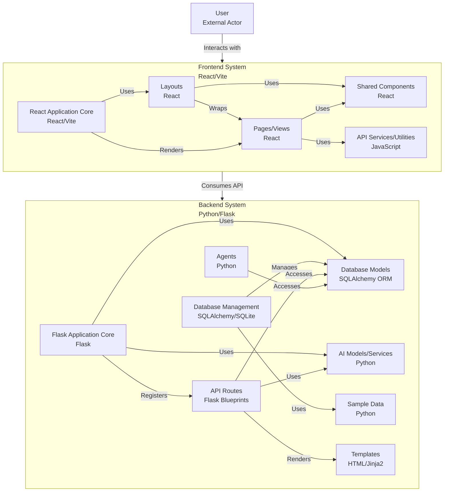

# SustainAlign Backend (Flask 3)

A comprehensive Flask API supporting the complete SustainAlign CSR/ESG management platform with AI agents, comprehensive data models, and automated workflows.

## 🌟 Features
- **JWT Authentication** - Multi-role user management (corporate, ngo, admin, regulator)
- **AI Agent Integration** - 6 specialized AI agents for CSR/ESG lifecycle management
- **AI-Powered Project Matching** - OpenRouter API integration for intelligent company-project alignment
- **Comprehensive Data Models** - 25+ models covering projects, companies, NGOs, impact tracking
- **Sample Data Seeding** - Rich, realistic data for development and demos
- **Modular Architecture** - Blueprint-based API organization with clean separation
- **Advanced Analytics** - Impact metrics, risk scoring, compliance tracking with real-time algorithms
- **Document Management** - File uploads, compliance documents, NGO certificates
- **Real-time Monitoring** - Project tracking, alerts, impact dashboards
- **Approval Workflows** - Multi-step project approval with AI insights
- **Risk Assessment** - NGO credibility scoring and corporate risk analysis
- **Impact Dashboard** - Advanced algorithms for impact analysis and predictions
- **Report Generation** - Automated compliance and impact reports
- **NGO Marketplace** - Comprehensive NGO profiles and collaboration tools

---

## 🏗️ System Architecture



### **Architecture Overview**

The SustainAlign platform follows a modern **client-server architecture** with clear separation of concerns:

#### **Frontend System (React/Vite)**
- **React Application Core**: Main application bootstrap and routing
- **Layouts**: Page structure and navigation components
- **Shared Components**: Reusable UI components and widgets
- **API Services**: HTTP client and data fetching utilities
- **Pages/Views**: Feature-specific page components

#### **Backend System (Python/Flask)**
- **Flask Application Core**: Main server application and configuration
- **Database Management**: SQLAlchemy ORM and database operations
- **API Routes**: RESTful endpoints organized in blueprints
- **Database Models**: Data models and business logic
- **AI Models/Services**: Machine learning and AI integration (OpenRouter API)
- **Agents**: Specialized AI agents for different workflows
- **Sample Data**: Seed data and test fixtures
- **Templates**: Server-side rendering templates (if needed)

#### **System Interactions**
- **User Interface**: Users interact with the React frontend
- **API Communication**: Frontend consumes backend APIs via HTTP
- **Data Flow**: Backend manages data persistence and business logic
- **AI Integration**: Backend provides AI-powered features and insights

---

## 🚀 Quick Start

1. **Create and activate virtual environment**
```bash
python -m venv .venv
.venv\Scripts\activate  # Windows PowerShell
source .venv/bin/activate  # macOS/Linux
```

2. **Install dependencies**
```bash
pip install -r requirements.txt
```

3. **Configure environment**
Create a `.env` file with:
```env
FLASK_ENV=development
SECRET_KEY=change-this-secret
CORS_ORIGIN=http://localhost:5173
PORT=5000
DATABASE_URL=sqlite:///sustainalign.db
PASSWORD_SALT=please-change-salt

# AI Integration (OpenRouter API)
OPENROUTER_API_KEY=your-openrouter-api-key-here
OPENROUTER_BASE_URL=https://openrouter.ai/api/v1
OPENROUTER_MODEL=openai/gpt-oss-20b:free

# Optional: Advanced Configuration
DEBUG=True
LOG_LEVEL=INFO
MAX_CONTENT_LENGTH=16777216
```

4. **Setup Database with Sample Data**
```bash
# Seed database with comprehensive sample data
python seed_database.py

# Alternative: Use migrate.py for basic setup
python migrate.py create
python migrate.py sample
```

5. **Run the server**
```bash
python app.py
```

API will be available at `http://localhost:5000`.

## 🗄️ Database Management

### Sample Data Seeding (Recommended)
```bash
# Comprehensive seeding with realistic data
python seed_database.py
```

This creates:
- **13 Users** (corporate, NGO, admin, regulator roles)
- **5 Companies** with complete profiles
- **15+ Projects** with milestones and impact reports
- **NGO Profiles** with transparency reports and certificates
- **AI Matches** and approval workflows
- **Impact Metrics** and monitoring data
- **Risk Assessments** and compliance tracking

### Basic Database Operations
```bash
# Create all tables from models
python migrate.py create

# Create basic sample data
python migrate.py sample

# Show database information
python migrate.py info

# Reset everything (drop + create + sample data)
python migrate.py reset
```

## 🏗️ Model Architecture

### Core Models (25+ Models)

#### **User & Authentication**
- `User` - Multi-role authentication (corporate, ngo, admin, regulator)
- `UserRole` - Company-specific role assignments

#### **Company Management**
- `Company` - Main company information
- `CompanyBranch` - Branch locations and details
- `CSRContact` - CSR contact person information
- `Budget` - CSR budget with flexible splits
- `FocusArea` - ESG goals and SDG priorities
- `NGOPreference` - NGO partnership preferences
- `AIConfig` - AI agent optimization settings

#### **Project & NGO Management**
- `Project` - CSR project details with SDG alignment
- `ProjectMilestone` - Project timeline and milestones
- `ProjectApplication` - Project funding applications
- `ProjectImpactReport` - Impact measurement and reporting
- `NGOProfile` - Comprehensive NGO information
- `NGOImpactEvent` - NGO impact tracking
- `NGODocument` - NGO certificates and documents
- `NGOTestimonial` - NGO success stories

#### **AI & Decision Support**
- `AIMatch` - Company-project alignment scoring
- `ApprovalRequest` - Project approval workflows
- `ApprovalStep` - Multi-step approval process
- `DecisionRationale` - AI decision explanations
- `RationaleNote` - Detailed reasoning notes

#### **Monitoring & Impact**
- `ImpactMetricSnapshot` - Real-time impact data
- `ImpactTimeSeries` - Historical impact trends
- `ImpactRegionStat` - Geographic impact distribution
- `ImpactGoal` - Impact targets and KPIs
- `ProjectTrackingInfo` - Real-time project monitoring
- `ProjectTimelineEntry` - Project timeline events

#### **Risk & Compliance**
- `NGORiskAssessment` - NGO credibility scoring
- `AuditEvent` - Compliance audit trail
- `ComplianceDocument` - Policy and certificate files

#### **Reporting & Analytics**
- `ReportJob` - Automated report generation
- `ReportArtifact` - Generated report files

## 🔌 API Endpoints

### **Authentication & Users**
- `POST /api/auth/signup` - User registration
- `POST /api/auth/login` - User authentication
- `POST /api/auth/forgot-password` - Password recovery
- `GET /api/profile/me` - Current user profile

### **Company & Profile Management**
- `GET /api/profile/companies` - List user companies
- `GET /api/profile/companies/<id>` - Company details
- `POST /api/profile/companies` - Create company profile
- `PUT /api/profile/companies/<id>` - Update company profile
- `POST /api/profile/companies/<id>/documents` - Upload documents

### **Project Discovery & Management**
- `GET /api/projects` - List/filter projects (public)
- `POST /api/projects` - Create project (guest fallback)
- `PUT /api/projects/:id` - Update project
- `GET /api/projects/:id/milestones` - Project milestones
- `GET /api/projects/:id/impact` - Project impact data

### **AI Matching & Alignment**
- `GET /api/ai-matches` - Company-project alignment scores
- `POST /api/ai-matches` - Generate new matches
- `GET /api/ai-matches/company/:id` - Company-specific matches

### **AI-Powered Project Matching (OpenRouter Integration)**
- `POST /api/ai-matching/generate-rationale` - Generate AI rationale for company-project matching
- `GET /api/ai-matching/company/:id/rationale` - Get company's AI matching rationale
- `GET /api/ai-matching/available-projects` - Get available projects for AI matching
- `POST /api/ai-matching/company/:id/analyze` - Analyze company for project matching

### **Approval Workflows**
- `GET /api/approvals` - List approval requests
- `GET /api/approvals/:id` - Approval details
- `POST /api/approvals/:id/steps/:step_id/status` - Update approval step
- `GET /api/approvals/:id/workflow` - Workflow timeline
- `PUT /api/approvals/:id/steps/:step_id` - Update approval step status
- `POST /api/approvals` - Create new approval request

### **Impact Monitoring & Analytics**
- `GET /api/impact/snapshots` - Impact metric snapshots
- `GET /api/impact/time-series` - Historical impact data
- `GET /api/impact/regions` - Geographic impact stats
- `GET /api/impact/goals` - Impact targets and KPIs
- `GET /api/impact/analytics` - Advanced impact analytics
- `GET /api/impact/geographic` - Geographic impact analysis

### **NGO Marketplace**
- `GET /api/projects/ngos` - NGO profiles (public)
- `GET /api/projects/ngos/:id` - NGO details
- `GET /api/projects/ngos/:id/impact-timeline` - NGO impact events
- `GET /api/projects/ngos/:id/documents` - NGO certificates
- `GET /api/projects/ngos/:id/transparency` - NGO transparency reports
- `GET /api/projects/ngos/:id/certificates` - NGO certificates
- `GET /api/projects/ngos/:id/testimonials` - NGO testimonials

### **Risk Assessment & Analysis**
- `GET /api/projects/ngo-risk` - NGO risk assessments
- `GET /api/projects/ngo-risk/:id` - Risk assessment details
- `POST /api/projects/ngo-risk` - Generate risk assessment
- `GET /api/projects/corporate-risk-analysis` - Corporate risk analysis
- `GET /api/projects/risk-metrics` - Risk metrics and scoring

### **Project Comparison & Matrix**
- `GET /api/comparisons` - Project comparison data
- `POST /api/comparisons` - Create new comparison
- `GET /api/comparisons/:id` - Comparison details
- `PUT /api/comparisons/:id` - Update comparison
- `DELETE /api/comparisons/:id` - Delete comparison

### **Reporting & Compliance**
- `POST /api/reports/generate` - Generate compliance reports
- `GET /api/reports/jobs` - Report generation jobs
- `GET /api/reports/artifacts` - Generated reports
- `GET /api/audit/events` - Compliance audit trail
- `GET /api/reports/types` - Available report types
- `POST /api/reports/export` - Export reports in various formats

### **Project Tracking & Monitoring**
- `GET /api/projects/tracking` - Project tracking data
- `GET /api/projects/timeline` - Project timeline events
- `GET /api/projects/status` - Project status updates
- `GET /api/projects/milestones` - Project milestones

### **System & Health**
- `GET /api/health` - System health check
- `GET /api/status` - System status and metrics
- `GET /api/version` - API version information

## 🤖 AI Integration & Advanced Features

### **OpenRouter AI Integration**
- **AI Model**: `openai/gpt-oss-20b:free` (configurable)
- **Project Matching**: Intelligent company-project alignment analysis
- **Rationale Generation**: Detailed explanations for matching decisions
- **JSON Response Parsing**: Structured AI responses for easy integration
- **Error Handling**: Graceful fallbacks with detailed error messages
- **Auto-Trigger**: Automatic AI analysis on page access

### **Advanced Analytics Engine**
- **Statistical Analysis**: Trend analysis and pattern recognition
- **Anomaly Detection**: Identify unusual patterns in project data
- **Predictive Modeling**: Forecast impact outcomes and risks
- **Geographic Clustering**: Regional impact analysis and visualization
- **Risk Assessment**: Multi-factor risk scoring algorithms
- **Benchmarking**: Performance comparison against industry standards

### **Real-Time Impact Algorithms**
- **Impact Scoring**: Dynamic impact calculation based on project metrics
- **Time Series Analysis**: Historical trend analysis and forecasting
- **Regional Distribution**: Geographic impact mapping and clustering
- **Goal Tracking**: Real-time progress monitoring against targets
- **Performance Metrics**: Advanced KPIs and efficiency calculations

---

## 📊 Sample Data Structure

### **Users & Roles**
- **Corporate Users**: 5 companies with sustainability officers
- **NGO Representatives**: 5 NGOs with project portfolios
- **Admin Users**: Platform administrators
- **Regulators**: Government auditors and inspectors

### **Projects & Impact**
- **Education Projects**: Digital literacy, rural education
- **Environmental Projects**: Clean water, tree planting, renewable energy
- **Healthcare Projects**: Medical camps, health awareness
- **Women Empowerment**: Skills training, entrepreneurship

### **AI Matching Data**
- **Alignment Scores**: 0-100% company-project fit
- **Risk Assessments**: NGO credibility and financial health
- **Impact Predictions**: Expected outcomes and KPIs
- **AI Rationales**: Detailed explanations for matching decisions
- **Confidence Scores**: AI confidence levels for recommendations

### **Workflow Data**
- **Approval Requests**: Multi-step approval processes
- **Decision Rationales**: AI explanations for recommendations
- **Audit Trails**: Complete compliance tracking
- **Project Status**: Funded, published, in-progress, completed
- **Timeline Events**: Milestone tracking and progress updates

### **Advanced Analytics Data**
- **Impact Metrics**: Real-time impact calculations and trends
- **Risk Alerts**: Automated risk detection and notifications
- **Geographic Data**: Regional impact distribution and clustering
- **Performance Benchmarks**: Industry comparison data
- **Predictive Models**: Forecast data and trend predictions

## 🔧 Development Workflow

### **Adding New Models**
1. **Create model file** in `models/` folder
2. **Update `models/__init__.py`** with new imports
3. **Add sample data** in `sample_data/` folder
4. **Update `seed_database.py`** for seeding
5. **Create tables**: `python seed_database.py`

### **Adding New API Endpoints**
1. **Create route file** in `routes/` folder
2. **Register blueprint** in `app.py`
3. **Add authentication** and validation
4. **Test endpoints** with `test_api.py`

### **Database Schema Updates**
```bash
# For new tables (preserves existing data)
python seed_database.py

# For complete reset
python migrate.py reset
```

### **AI Integration Development**
1. **Configure OpenRouter API**: Set up API key in `.env`
2. **Test AI Models**: Use `test_model.py` for API testing
3. **Update AI Services**: Modify `ai_models/` directory
4. **Add New AI Features**: Extend AI matching capabilities

---

## 🚀 Recent Improvements & Fixes

### **API Endpoint Organization**
- **Blueprint Registration**: Organized routes with proper URL prefixes
- **Route Conflicts Resolved**: Fixed overlapping route definitions
- **API Base URLs**: Standardized endpoint structure
  - `/api/projects/*` - Project and NGO related endpoints
  - `/api/comparisons/*` - Comparison matrix endpoints
  - `/api/approvals/*` - Approval workflow endpoints
  - `/api/ai-matching/*` - AI matching endpoints

### **AI Integration Enhancements**
- **OpenRouter API Integration**: Complete AI model integration
- **JSON Response Parsing**: Robust parsing of AI responses
- **Error Handling**: Comprehensive error handling with fallbacks
- **Auto-Trigger Logic**: Automatic AI analysis on page access
- **Environment Configuration**: Proper API key management

### **Database & Data Management**
- **Schema Updates**: Added missing columns and relationships
- **Sample Data Enhancement**: Comprehensive realistic data
- **Migration Scripts**: Improved database migration process
- **Data Validation**: Enhanced data integrity checks

### **Frontend-Backend Integration**
- **API Client Updates**: Updated frontend API calls to match backend routes
- **Error Handling**: Improved error messages and user feedback
- **Loading States**: Enhanced loading and error states
- **Data Flow**: Optimized data flow between frontend and backend

### **Performance & Reliability**
- **Response Optimization**: Improved API response times
- **Error Recovery**: Better error recovery mechanisms
- **Data Caching**: Intelligent data caching strategies
- **Resource Management**: Optimized resource usage

## 🧪 Testing

### **API Testing**
```bash
# Run comprehensive API tests
python test_api.py

# Test specific endpoints
curl -X GET http://localhost:5000/api/health
```

### **Sample Data Testing**
After seeding, test with:
- **Corporate Login**: `admin@techcorp.com` / `admin123`
- **NGO Login**: `director@womenempowerment.org` / `women123`
- **Admin Login**: `admin@sustainalign.local` / `admin123`

## 🚀 Production Deployment

### **Environment Setup**
- Use PostgreSQL/MySQL instead of SQLite
- Set strong `SECRET_KEY` and `PASSWORD_SALT`
- Configure proper `CORS_ORIGIN` for production domain
- Enable HTTPS and security headers

### **Database Migration**
1. **Backup existing data**
2. **Update models** and dependencies
3. **Run migrations** carefully
4. **Verify data integrity**

### **Security Considerations**
- Change all default secrets
- Implement rate limiting
- Add proper logging and monitoring
- Use cloud storage for file uploads
- Regular security audits

## 📁 Project Structure
```
backend/
├── app.py                 # App factory and blueprint registration
├── models.py              # Main models import (backward compatibility)
├── seed_database.py       # Comprehensive sample data seeding
├── migrate.py             # Basic database migration scripts
├── test_api.py            # API testing script
├── test_model.py          # AI model testing script
├── requirements.txt       # Python dependencies
├── env_example.txt        # Environment variables template
├── models/                # Modular model structure
│   ├── __init__.py        # Model exports
│   ├── base.py            # SQLAlchemy database instance
│   ├── user.py            # User authentication model
│   ├── company_details.py # Company and profile models
│   ├── projects.py        # Project and NGO models
│   ├── ai_matching.py     # AI matching and alignment
│   ├── approval.py        # Approval workflows
│   ├── impact.py          # Impact monitoring models
│   ├── risk.py            # Risk assessment models
│   ├── reporting.py       # Reporting and compliance
│   ├── tracker.py         # Project tracking models
│   └── ngo_marketplace.py # NGO marketplace models
├── ai_models/             # AI integration and services
│   ├── __init__.py        # AI models package
│   ├── ai_model.py        # Core AI model for OpenRouter API
│   └── ai_matching_service.py # AI matching service layer
├── agents/                # AI agents for different workflows
│   ├── discovery_agent.py # Project discovery agent
│   └── ...                # Other specialized agents
├── sample_data/           # Comprehensive sample data
│   ├── __init__.py        # Sample data aggregator
│   ├── user_sample.py     # User and role data
│   ├── company_details_sample.py # Company profiles
│   ├── projects_sample.py # Projects and NGOs
│   ├── ai_matching_sample.py # AI matching data
│   ├── approval_sample.py # Approval workflows
│   ├── impact_sample.py   # Impact metrics
│   ├── ngo_marketplace_sample.py # NGO marketplace
│   ├── risk_sample.py     # Risk assessments
│   ├── tracker_sample.py  # Project tracking
│   └── reporting_sample.py # Reporting data
├── routes/                # API endpoints
│   ├── auth.py            # Authentication endpoints
│   ├── profile.py         # Company profile management
│   ├── projects.py        # Project management
│   ├── reports.py         # Reporting endpoints
│   ├── approvals.py       # Approval workflow endpoints
│   ├── ai_matching.py     # AI matching endpoints
│   └── views.py           # Admin HTML views
└── templates/             # HTML templates
```

## 🔍 Troubleshooting

### **Common Issues**

**Import Errors:**
```bash
# Ensure virtual environment is activated
.venv\Scripts\activate  # Windows
source .venv/bin/activate  # macOS/Linux

# Check Python path
which python  # Should show .venv/bin/python
```

**Database Issues:**
```bash
# Reset database completely
python seed_database.py

# Check database status
python migrate.py info
```

**API Errors:**
```bash
# Check server status
curl http://localhost:5000/api/health

# Check server logs
python app.py
```

### **Sample Data Issues**
- Ensure all sample data files are present
- Check database file permissions
- Verify model relationships are correct

### **AI Integration Issues**
```bash
# Test OpenRouter API connection
python test_model.py

# Check environment variables
echo $OPENROUTER_API_KEY

# Verify API key format
# Should be: sk-or-v1-xxxxxxxxxxxxxxxxxxxxxxxxxxxxxxxxxxxxxxxx
```

**Common AI Issues:**
- **401 Authentication Error**: Check OPENROUTER_API_KEY in .env
- **JSON Parsing Errors**: AI response format issues
- **API Rate Limits**: OpenRouter API usage limits
- **Model Availability**: Check if selected model is available

### **API Endpoint Issues**
```bash
# Test API endpoints
curl http://localhost:5000/api/health
curl http://localhost:5000/api/projects/ngos
curl http://localhost:5000/api/approvals

# Check blueprint registration
python app.py
```

**Common API Issues:**
- **404 Not Found**: Check blueprint registration in app.py
- **Route Conflicts**: Ensure unique URL prefixes
- **CORS Errors**: Verify CORS_ORIGIN configuration
- **Database Errors**: Check database schema and migrations

## 🌟 Key Benefits

### **For Developers**
- **Rich Sample Data**: Immediate testing and development
- **Modular Architecture**: Easy to extend and maintain
- **Comprehensive Models**: Covers entire CSR/ESG lifecycle
- **AI Integration Ready**: Built for AI agent workflows

### **For Stakeholders**
- **Realistic Demos**: Show platform capabilities immediately
- **Complete Workflows**: End-to-end CSR management
- **AI Insights**: Demonstrate AI agent value
- **Compliance Ready**: Built for regulatory requirements

## 📚 Additional Resources

- **Model Documentation**: `models/README.md`
- **API Testing**: `test_api.py`
- **Sample Data**: `sample_data/` folder
- **Database Schema**: `PROJECT_MODELS_SUMMARY.md`

---

**Made with care for sustainability-minded teams 🌍**
